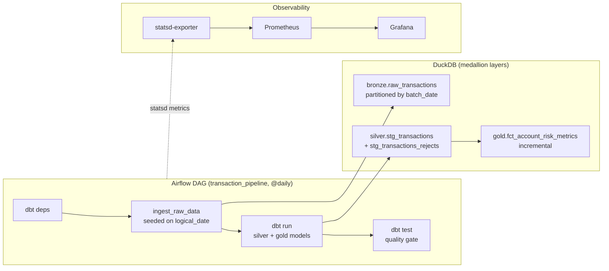
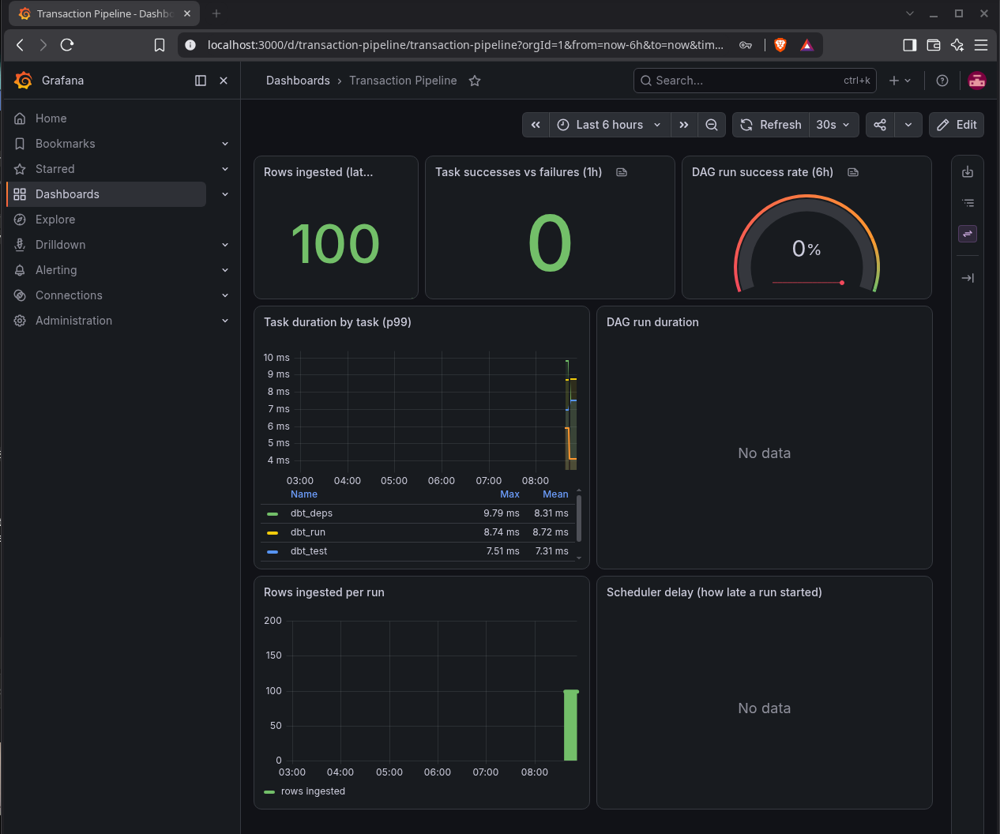

# Financial Data Orchestration

[](https://github.com/grunundweiss/financial-data-orchestration/actions/workflows/ci.yml)

A daily transaction pipeline: Airflow schedules it, dbt models it in DuckDB, dbt tests gate it, and Prometheus/Grafana show whether it's healthy. Runs are idempotent and backfillable — re-running any logical date reproduces that date's data exactly.

## How it works



**Data layers**
* **Bronze (`bronze.raw_transactions`)** — raw daily transactions in NOK, ingested unmodified and partitioned by `batch_date`. Written by the `ingest_raw_data` task ([airflow/dags/pipeline_tasks.py](airflow/dags/pipeline_tasks.py)).
* **Silver (`silver.stg_transactions`)** — dbt view: cleaning plus risk-profile classification. Rows with no `transaction_id` are excluded here but captured in `silver.stg_transactions_rejects`, so the drop is counted rather than silent.
* **Gold (`gold.fct_account_risk_metrics`)** — dbt incremental table: one row per account per day, with net balance and high-value exposure.
* **Quality gate** — `dbt test` runs 14 tests ([schema.yml](dbt_project/models/schema.yml) plus two custom singular tests in [dbt_project/tests/](dbt_project/tests/)) as the DAG's final task. The DAG fails if any fail.

The DAG code is split in two so the business logic stays testable without installing Airflow:
* [airflow/dags/pipeline_tasks.py](airflow/dags/pipeline_tasks.py) — plain functions, no Airflow import.
* [airflow/dags/transaction_pipeline.py](airflow/dags/transaction_pipeline.py) — the DAG (TaskFlow API) wiring those functions together.

## Idempotency and backfill

Every run is a pure function of its logical date.

`ingest_raw_transactions` seeds its random generator on `logical_date`, so the batch for 2026-01-15 is byte-identical whether it was generated on the day or backfilled six months later. The write is partition-scoped — `DELETE FROM bronze.raw_transactions WHERE batch_date = ?` followed by `INSERT` — so re-running one date replaces only that date's rows and never touches another day's.

The gold model follows the same rule. Its grain is one row per account **per `batch_date`**, materialized `incremental` with a `delete+insert` strategy on `['account_id', 'batch_date']`. Each run only aggregates the day it was given, so backfilling out of order can't double-count or overwrite neighbouring days.

Two consequences worth stating explicitly:

* **`catchup=True` is meaningful.** A three-day backfill produces three distinct partitions and 300 rows, asserted in [tests/test_analytics.py](tests/test_analytics.py).
* **Retries are only safe because of this.** `default_args` sets `retries=2` with exponential backoff. A retry re-executes the same logical date — which is harmless precisely because that operation is idempotent. Retries on a non-idempotent task would duplicate data instead of recovering from a failure.

## Design decisions

**Why DuckDB over Postgres.** The analytical workload here is columnar aggregation over a single node's worth of data. DuckDB gives that with zero infrastructure — the warehouse is a file — which keeps the repo cloneable and runnable in one command. The tradeoff is the next point.

**Why `max_active_runs=1`.** DuckDB takes an exclusive write lock on its database file. Concurrent DAG runs would contend for it and deadlock, so the scheduler is constrained to one run at a time. This is a case where the storage engine's concurrency model dictates the scheduler config; on Postgres or Snowflake this limit could be lifted.

**Why business logic lives outside the DAG file.** `pipeline_tasks.py` has no Airflow import, so the test suite exercises real ingestion and real dbt runs without installing or booting Airflow. The DAG file is left as thin wiring.

**Why rejects are quarantined rather than filtered.** A `WHERE ... IS NOT NULL` that silently drops rows lets a pipeline discard most of a day's data and still report success. `stg_transactions_rejects` captures exactly what was dropped, and `reject_rate_below_threshold.sql` fails the quality gate if rejects exceed 5% of a batch.

**Why a statsd mapping config.** Without one, Airflow's dotted metric names become one Prometheus metric per DAG and task, which can't be grouped or filtered. [monitoring/statsd-mapping.yml](monitoring/statsd-mapping.yml) lifts `dag_id` and `task_id` into labels so the dashboard queries stay stable as DAGs are added.

## Getting started

**Prerequisites:** Python 3.14+, Docker & Docker Compose, Git.

```bash
git clone https://github.com/grunundweiss/financial-data-orchestration.git
cd financial-data-orchestration
python3 -m venv .venv && source .venv/bin/activate
pip install -e ".[dev]"
```

Then configure local secrets:

```bash
cp .env.example .env
python -c "from cryptography.fernet import Fernet; print(Fernet.generate_key().decode())"
```

Paste the key into `AIRFLOW__CORE__FERNET_KEY` in `.env`, set the Airflow and Grafana passwords, and set `AIRFLOW_UID` to your own user id (`id -u`) so container-written files aren't owned by another uid. `.env` is gitignored — never commit it.

### Run the tests

Ingests mock data into DuckDB and runs a real `dbt run` / `dbt test` against it. No Docker required:

```bash
pytest -v
```

### Run the full platform

```bash
docker compose up airflow-init      # one-time DB migration + admin user
docker compose up -d --wait         # Airflow, Postgres, statsd-exporter, Prometheus, Grafana
```

* **Airflow**  `http://localhost:8080` (login from `.env`). Unpause and trigger `transaction_pipeline`, or:
  ```bash
  docker compose exec airflow-apiserver airflow dags trigger transaction_pipeline
  ```
* **Prometheus**  `http://localhost:9090`; the `airflow_pipeline_metrics` target should be `UP`.
* **Grafana**  `http://localhost:3000`. The Prometheus datasource and the **Transaction Pipeline** dashboard are provisioned automatically from [monitoring/grafana/](monitoring/grafana/) , theremore no manual setup is required.

Tear down with `docker compose down -v`.



Rows ingested, task duration, and task success/failure counts come from `airflow dags test` runs — the same command CI uses. "DAG run duration" and "scheduler delay" stay empty until the DAG has run through the actual scheduler (`airflow dags trigger`, or its `@daily` schedule firing), since `dags test` bypasses the scheduler path those two metrics are emitted from.

## CI

[.github/workflows/ci.yml](.github/workflows/ci.yml) runs on every push and PR to `main`:

1. **`test`** — `ruff check`, `mypy`, then `pytest` (real dbt run/test against DuckDB).
2. **`airflow-smoke-test`** — builds the Airflow+dbt image, boots the full compose stack, asserts zero DAG import errors, runs the DAG end-to-end with `airflow dags test`, **re-runs the same logical date and asserts the row count didn't change**, and verifies Grafana provisioned its datasource.

That second job runs the real scheduler, so when a DAG that imports cleanly but fails at runtime, or an ingestion change that quietly breaks idempotency, it fails CI rather than passing a mocked test.

## Known limitations

* **Single node.** LocalExecutor and an embedded DuckDB file; no distributed execution.
* **DuckDB is single-writer**, which is why `max_active_runs=1`. Concurrent DAG runs are not possible without swapping the warehouse.
* **Mock data.** `ingest_raw_transactions` generates transactions rather than reading a real feed; the seeding makes it reproducible, not realistic.
* **No CDC and no SCD2.** Bronze is a full daily partition, not a change stream, and dimensions have no history tracking.
* **The failure callback logs.** `alert_on_failure` writes to the task log; wiring it to Slack or PagerDuty is left as a deployment concern.

## License

MIT — see [LICENSE](LICENSE).
