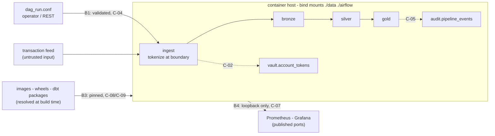

# Threat model

One page. What this pipeline holds, where untrusted things cross into it, what
is defended, and — the part that matters most — what isn't.

## Scope and honesty about it

**The data is synthetic.** `ingest_raw_transactions` generates transactions; no
real account has ever been in this warehouse. Nothing here is actually at risk.

The point of the exercise is that *before this work, the pipeline had no
mechanism that would have behaved differently if the data were real*. That
absence was the finding. The controls below are real and tested; the stakes
are not.

This is a personal project, not a regulated system. Controls are *mapped* to
DORA chapters in [security/controls.yaml](../security/controls.yaml) to show
they were chosen against a real framework — that is a reasoning exercise, not
a compliance claim.

## Assets

A threat model that lists only threats is half a document.

| Asset | Why it matters |
|---|---|
| Bronze transaction rows and the account identifiers in them | The thing an attacker would actually want |
| `vault.account_tokens` | The only mapping from token back to real identifier — compromising it undoes tokenization |
| `ACCOUNT_TOKEN_PEPPER` | The HMAC key. Leaking it makes every token reversible by brute force over a small account space |
| The DuckDB warehouse file | Unencrypted, on a host bind mount; whoever can read the folder reads everything |
| Airflow metadata DB and its Fernet key | Holds every connection and variable the platform has |
| The dbt models | Encode business and regulatory logic — the `-100000` net-position floor is a rule, not a preference |
| `audit.pipeline_events` | The evidence that a given day's data passed the gate. Worthless if silently editable |
| The container image and its dependency tree | Determines what code actually runs at 03:00 |

## Trust boundaries

Four places where something crosses from outside our control to inside it.

**B1 — untrusted parameters into templated SQL.** `batch_date` can come from
`dag_run.conf` on a manual backfill and is interpolated into the gold model's
incremental filter. Validated by parsing (not pattern-matching) at the DAG
boundary, re-validated in `run_dbt`, and re-asserted in the model's own Jinja
so the model is safe regardless of caller. → C-04

**B2 — the warehouse at rest.** A DuckDB file on a host bind mount, no
encryption, no column-level access control. Mitigated by never letting the raw
identifier land there: tokens are written at ingestion, and the mapping lives
in a separate vault table. → C-01, C-02

**B3 — the supply chain.** Images, Python wheels, and dbt packages. Previously
three images floated on `latest` and `dbt deps` ran *inside the DAG*, so a
03:00 run could execute macro SQL from a version that didn't exist when the
code was written. Now tag-pinned, exact-pinned, and resolved at image build.
→ C-08, C-09

**B4 — the published observability surface.** Prometheus and statsd-exporter
previously listened on all interfaces with no authentication; Airflow's metrics
stream describes pipeline structure and volumes to anyone who can scrape it.
Now bound to `127.0.0.1`. → C-07

## What is explicitly not defended

Naming these is the point of the document.

- **No encryption at rest.** The warehouse file is readable by anyone with
  filesystem access to `./data`. Tokenization reduces what that gets them; it
  does not stop them.
- **No authentication between internal services.** Prometheus scrapes
  statsd-exporter, and Grafana queries Prometheus, with no credentials.
  Loopback binding is the whole control.
- **Grafana runs as a single shared admin.** There is no per-user access model
  and no viewer role split.
- **Containers run in group 0.** The upstream Airflow image expects a
  group-writable `/opt/airflow`, so this is mitigated (`no-new-privileges`)
  and documented rather than removed. Capabilities are not dropped on the
  Airflow services because `airflow-init` chowns the bind mounts.
- **Tokenization is deterministic, and that is a real trade-off.** The gold
  model groups by account and a dbt `relationships` test joins gold to silver,
  so the same input must always produce the same token. An attacker who can
  submit known identifiers and observe the warehouse can therefore confirm
  whether an account is present. Salting per-row would break the pipeline's
  own correctness tests; this is a deliberate choice, not an oversight.
- **The pepper is not rotated.** Rotation invalidates every existing token and
  would require re-tokenizing the warehouse. There is no procedure for it.
- **No SBOM, and images are tag-pinned rather than digest-pinned.** A tag can
  be repointed at different bytes. Digest pinning needs a registry round-trip
  that has not been done. → C-08 is marked `partial` for exactly this reason.
- **C-09 is not fully proven.** `dbt deps` has moved into the image build, but
  no smoke test yet runs the DAG with egress blocked, which is what would
  actually demonstrate zero runtime network dependency.
- **The audit ledger is append-only by convention, not by permission.** Nothing
  stops a writer with warehouse access from rewriting it — the chain makes that
  *detectable*, not impossible. There is no external anchor (no notarization,
  no append-only storage), so an attacker who rewrites the whole chain
  consistently would not be caught by `verify-chain` alone.
- **No key management.** Secrets live in a gitignored `.env` on the host. There
  is no KMS, no SOPS-encrypted config in the repo, and no rotation procedure.

## Findings this model came from

The ten findings from the original audit, and where each is now handled:

| ID | Finding | Status |
|---|---|---|
| F-01 | Jinja-interpolated SQL in the gold model | Fixed — C-04 |
| F-02 | Database credentials committed in plain text | Fixed — C-03 |
| F-03 | Secrets fail open via `:-default` | Fixed — C-03 |
| F-04 | The CI described in the README did not exist | Fixed — C-07 |
| F-05 | History rewritable with no trace | Fixed — C-05 |
| F-06 | Account identifiers in clear text end to end | Fixed — C-01, C-02 |
| F-07 | Observability surface published without authentication | Fixed — C-07 |
| F-08 | Unpinned and runtime-resolved supply chain | Partial — C-08, C-09 |
| F-09 | Containers run with root group and full capabilities | Mitigated and documented |
| F-10 | Stale requirements file contradicting the real pins | Fixed |
